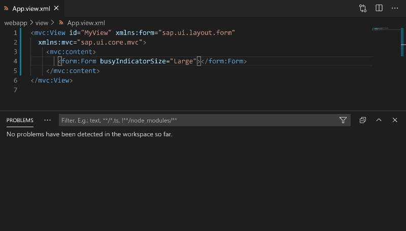

# UI5 Language Support

A VSCode extension providing SAPUI5 language editor support.

## Features

### XML Views Auto-Complete / Context-Assist

#### Preview

#### Description

- Relevant filters would be applied to suggestions, e.g:

  - Only classes that match the parent aggregation's **type** would be offered.
  - In a "full" aggregation with cardinality `0..1`, no more suggestions would be made.
  - Only classes inside the xmlns prefix used would be offered.
  - Deprecated and Experimental SAPUI5 node would not be offered by default (configurable).

- Additional text would be inserted for ease of use, e.g:

  - Auto insertion of closing tags name for classes and aggregations.
  - Auto insertion of `=""` for attributes keys suggestions.
  - Auto insertion of xmlns prefix for classes and aggregation tags.

- Tooltips will be shown while browsing the suggestions.

  - Including a clickable link to the SAPUI5 SDK.

#### Available In:

- In XML tags:

  - Classes.
  - Aggregations.

- In XML attribute keys:

  - Properties.
  - Events.
  - Associations.
  - Namespaces prefixes.

- In XML attribute values:
  - Enum values.
  - Boolean values.
  - Namespaces fully qualified names.

### XML Views Validations

#### Preview

#### Description

The list of validations and their severity are currently hard-coded
and cannot be configured by the end user.

#### Validations List

- Errors:

  - Invalid boolean values.
  - Unknown attribute keys.
  - Unknown eum values.
  - Unknown xmlns namespace.
  - Unknown tag names.
  - None unique tags IDs.
  - Wrong cardinality of aggregation.
  - Wrong type of tags inside aggregations.

- Warnings:

  - Use of deprecated classes.
  - Use of deprecated aggregations.
  - Use of deprecated properties.
  - Use of deprecated events.
  - Use of deprecated associations.

### XML Views Hover Tooltips

#### Preview

#### Description:

Tooltips will be shown while hovering over an item.

#### Available In:

- in XML Tags

  - Classes.
  - Aggregations.

- In XML attribute keys:

  - Property / event / association / aggregation.

- In XML attribute Values:

  - Enum fields / SAPUI5 Namespaces

### manifest.json Auto-Complete and Validations

#### Preview

#### Description:

Implemented using the UI5 [manifest.json schema](https://github.com/SAP/ui5-manifest/blob/master/schema.json).

## Installation

### From the VSCode Marketplace

Click the `install` button on [UI5 Language Assistant VSCode marketplace page](https://marketplace.visualstudio.com/items?itemName=SAPOSS.ui5-language-assistant).

### From Github Releases

The extension can also be downloaded and installed via [Github Releases](https://github.com/sap/ui5-language-assistant/releases).

- The .vsix archive can be found under the **"ui5-language-assist\@x.y.z"** releases.
  - Replace `x.y.z` with the desired version number.
- See [VSCode's guide](https://code.visualstudio.com/docs/editor/extension-gallery#_install-from-a-vsix)
  for installing an extension from a .vsix file.

### Usage

This extension's features will automatically be enabled when opening/editing relevant SAPUI5 source files.
In the case of SAPUI5 XML views this means:`*.view.xml` or `*.fragment.xml` files.

Note that the extension **lazily** downloads the SAPUI5 metadata needed for its features.
This means there may be a delay between starting VSCode and having the relevant features available.

### Limitations

#### SAPUI5 Version

This extension currently uses a hard-coded (1.71.x) version for the SAPUI5 metadata.

#### Custom Controls

This extension does not currently support custom controls, some features, e.g: validations
may use heuristics to guess a tag is a custom control, however no auto-complete is currently offered
for custom controls.

### Support

Please open [issues](https://github.com/SAP/ui5-language-assistant/issues) on github.

### Contributing

See [CONTRIBUTING.md](./CONTRIBUTING.md).

### License

Copyright (c) 2020 SAP SE or an SAP affiliate company. All rights reserved.
This file is licensed under the Apache Software License, v. 2 except as noted otherwise in the [LICENSE file](../../LICENSE).
